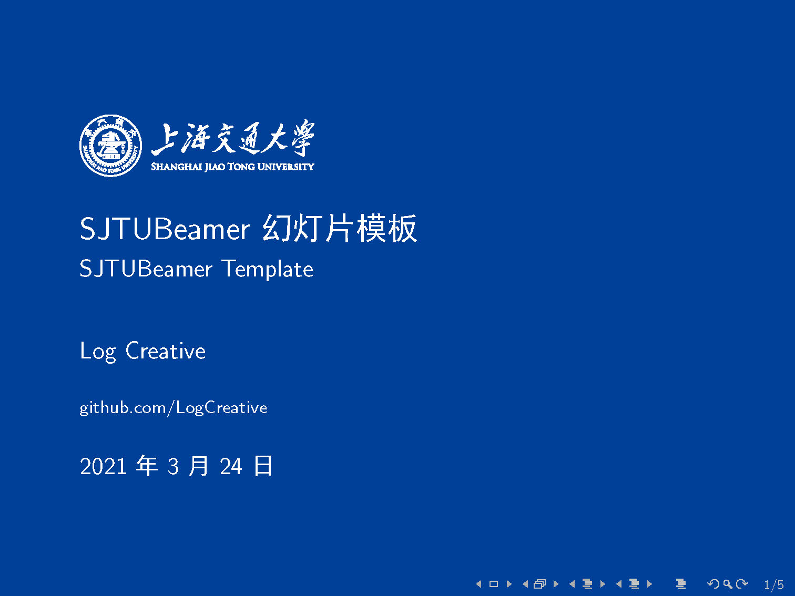
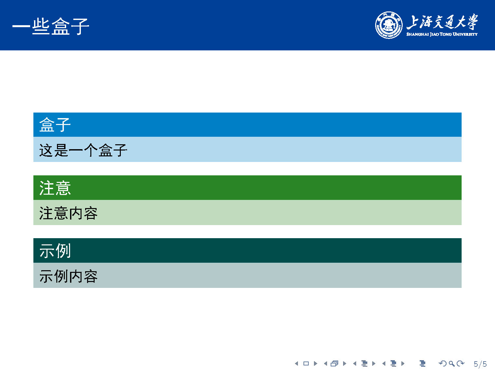

# SJTUBeamer
上海交通大学 LaTeX Beamer 幻灯片模板

SJTUBeamer 样式为上海交通大学幻灯片模板的非官方实现版本，遵守[上海交通大学视觉形象识别系统](http://vi.sjtu.edu.cn/)的相关规范，图标版权归上海交通大学所有，本项目仅供校内人员学习参考使用。

目前该样式仍然处于开发者预览版本，仍在做适应性修改并适当添加图案。欢迎通过拉取请求对本模板提出修改建议。

[SJTUBeamer 样式文档](https://github.com/LogCreative/SJTUBeamer/blob/main/doc/SJTUBeamertheme.pdf)

> Copyright 2021 Log Creative
> 
> This work may be distributed and/or modified under the
conditions of the LaTeX Project Public License, either version 1.3
of this license or (at your option) any later version.
>
> The latest version of this license is in
https://www.latex-project.org/lppl.txt
and version 1.3 or later is part of all distributions of LaTeX
version 2005/12/01 or later.
>
>This work has the LPPL maintenance status ‘maintained’.
>
>The Current Maintainer of this work is Log Creative.